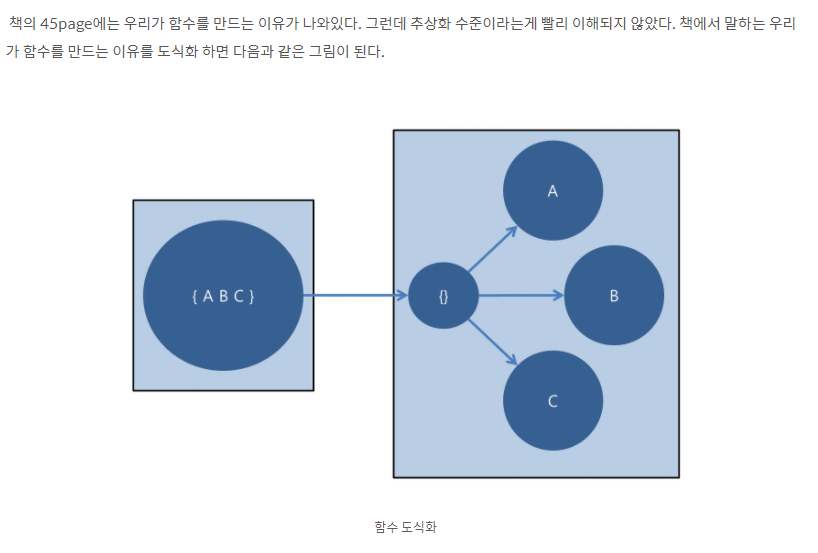

# CH3 

# 함수

Functions are the first line of organization in any program.

프로그램의 기본 = 함수

you can understand that in the next 3 minutes.

함수는 기본적으로 3분 안에 이해가 가야한다


## 작게!

This implies that the blocks within if statements, else statements, while statements, and so on should be one line long.

중첩구조에 들어가는 블록은 한 줄이어야한다.

Not only does this keep the enclosing function small, but it also adds documentary value

 = 빌트인을 잘 이용해라


## 하나만 해라

함수는 한가지를 해야한다

If a function does only those steps that are one level below the stated name of the function, then the function is doing one thing.


## 함수당 하나의 추상화 수준

> One Level of Abstraction per Function


# 추상화 수준 ?

> 오늘은 이거다

**함수를 만드는 이유는 큰 개념을 다음 추상화 수준에서 여러 단계로 나눠 수행하기 위해서가 아니던가. **

**- CleanCode**




 "추상화 수준은 높음, 중간, 낮음으로 구분 할 수 있고 추상화 수준을 높음으로 유지하고 추상화 수준이 중간은 지양한다. "라는 **유토피아 코딩**을 꿈꾸며 우리는 **추상화 수준**이라는 **커뮤니케이션 스킬**을 얻었다.

...에?


## Switch 문

It’s hard to make a small switch statement.

if/else의 연속 도 마찬가지! => 스위치와 if,else 문과 비슷한게 아닐까 추측


## 서술적인 이름을 사용해라

서술형 이름을 사용한다면 코드를 순차적으로 이해하기 쉬워진다.

Be consistent in your names. 일관성을 유지하라


## 함수 인수

The ideal number of arguments for a function is zero (niladic).

이상적인 함수의 인수의 갯수 = 0 => 무항

Next comes one (monadic), followed closely by two (dyadic)


### 단항

You may be **asking a question about that argument**, as in `boolean fileExists(“MyFile”)`

you may be **operating on that argument**, transforming it into something else and returning it. 

`InputStream fileOpen(“MyFile”)` **transforms a file name String** into an InputStream return value. 

1 인수에 질문을 던지는 경우

2 인수를 무언가로 변환해 결과를 반환하는 경우

3 이벤트 함수일 경우 (이벤트 함수라는 것을 명시해야함)

Try to avoid any monadic functions that don’t follow these forms,

그러나 단항 함수는 가급적 피하는 것이 좋다. => 왜...? => 이해하기 어려워서


### 플래그

bool, string 등을 함께 넘겨서 로직을 분기하는 방법

못생겼다 -> 추하다로 번역

쓰지마라 => 애초에 쓰는 방법도 몰라서 괜찮


### 이항함수

단항함수보다 이해하기가 더 어렵다

가능하면 단항으로 바꾸는 것이 좋다


### 삼항함수

위험도는 이항함수보다 2배 높다

신중하게 고려하고 만들어라


### 인수 객체

인수가 많이 필요할 경우 => 객체로(클래스 변수로) 선언하는 것도 나쁘지 않다


### 인수 목록

Sometimes we want to pass a variable number of arguments into a function. Consider, for example, the String.format method

String.format 같은 인수개수가 가변적인 함수도 필요할 때가 있다

인수는 list형 인수이기 때문에 이항함수라고 말을 할 수 있다.


### 동사, 키워드

단항함수는 함수와 인수가 동사, 명사 쌍을 이뤄야한다

` writeField(name)`


## 사이드 이펙트를 일으키지 말아라

Side effects are lies.


## Command Query Separation

### 명령과 질문을 분리하라

Functions should either do something or answer something, but not both.

Either your function should change the state of an object, or it should return some information about that object.

함수는 객체 상태를 변경하거나, 객체 정보를 반환하거나 둘중 하나이다

둘다 수행해서는 안된다


## 오류 코드보다 예외를 사용해라

```java
if (deletePage(page) == E_OK) {
	if (registry.deleteReference(page.name) == E_OK) {
		if (configKeys.deleteKey(page.name.makeKey()) == E_OK){
			logger.log("page deleted");
			} 
		else {
			logger.log("configKey not deleted");
			}
	} 
	else {
		logger.log("deleteReference from registry failed");
	}
} 
else {
	logger.log("delete failed");
	return E_ERROR;
}
```

```java
try {
deletePage(page);
registry.deleteReference(page.name);
configKeys.deleteKey(page.name.makeKey());
}
catch (Exception e) {
logger.log(e.getMessage());
}
```

if, else 보다는 except를 이용하자는 의미


## 반복하지 마라

Duplication may be the root of all evil in software.


## 구조적 프로그래밍

**루프 안에서 break나 continue를 사용해선 안되며  goto는 절대로, 절대로 사용하지 말자.**

Following these rules means that there should only be one return statement in a function, no break or continue statements in a loop, and never, ever, any goto statements.


## 함수를 이렇게 짜고 있는가?

Writing software is like any other kind of writing.

I don’t write them that way to start. I don’t think anyone could


