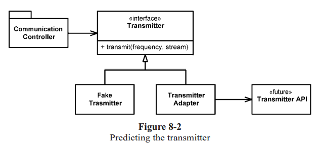

# CH8 Boundaries(경계)

Sometimes we buy third-party packages or use open source.

우리는 가끔 서드파티 패키지나 오픈소스를 사용해야될 상황에 놓인다

우리는 이 코드들을 우리 코드와 통합시켜야한다.

In this chapter we look at practices and techniques to keep the boundaries of our software **clean**.


## 서드 파티 코드 사용

There is a natural tension between the provider of an interface and the user of an interface.

natural tension 자연스러운 긴장, 필연적인 긴장...

Providers of third-party packages and frameworks strive for broad applicability so they can work in **many environments** and **appeal to a wide audience**. 

Users, on the other hand, want an interface that is focused on **their particular needs**. 

**This tension can cause problems** at the boundaries of our systems

```
clear() void – Map
containsKey(Object key) boolean – Map
containsValue(Object value) boolean – Map
entrySet() Set – Map
equals(Object o) boolean – Map
get(Object key) Object – Map
getClass() Class<? extends Object> – Object
hashCode() int – Map
isEmpty() boolean – Map
keySet() Set – Map
notify() void – Object
notifyAll() void – Object
put(Object key, Object value) Object – Map
putAll(Map t) void – Map
remove(Object key) Object – Map
size() int – Map
toString() String – Object
values() Collection – Map
wait() void – Object
wait(long timeout) void – Object
wait(long timeout, int nanos) void – Object
```

만약 우리가 Sensor클래스를 저장하는 Map객체를 사용한다면 다음과 같은 형태일 것

```
Map sensors = new HashMap();
```

한문장으로 끝

제일 좋은 방법은 래핑

but 모든 map을 다 매핑하는 것은 아니다

다만 Map과 같은 "경계에 있는 인터페이스"를 시스템 전반에 걸쳐 돌려가며 사용하지 말고

​			해당 객체를 사용하는 클래스 내부에 넣던지 가까운 계열의 클래스에 넣어라.

​			공개된 api에서 인자로 받거나 리턴하지 마라.


## 경계를 탐험하고 공부

Third-party code helps us get more functionality delivered in less time.

Learning the third-party code is hard. 

Integrating the third-party code is hard too. 

Doing both at the same time is doubly hard.

Instead of experimenting and trying out the new stuff in our production code, we could write some tests to explore our understanding of the third-party code.

=> 이론을 쓰려면 알고 써야지.... 
맞말추


## log4j 공부하기

C언어 라이브러리임

패스


## Learning Tests Are Better Than Free

### 자유보다는 학습테스트가 더 좋다

값어치를 한다라고도 해석

Not only are learning tests free, they have a positive return on investment.

공짜 + 투자는 긍정적인 리턴을 준다.

메인 로직에 영향을 주지 않으며 서드파티 코드를 이해할 수 있다.

서드파티 코드가 바뀔 경우 Learning test를 돌려 아직 우리가 필요한 기능이 잘 동작하는지 테스트할 수 있다.

Learning test를 하던 말던, 경계 테스트는 새 버전으로의 이전에 도움을 준다.


## 존재하지 않는 코드 사용

모듈이 필요한데 아직 개발이 되지 않는 모듈일 경우

=> 이러한 조건때문에 구현이 늦어진다

=> 인터페이스를 정의함으로 메인 로직을 더 깔끔하게 짜고, 목표를 명확하게 할 수 있다.



```
예시
1.저자는 무선통신 시스템을 구축하는 프로젝트를 하고 있었다.
2.그 팀 안의 하부 팀으로 "송신기"를 담당하는 팀이 있었는데 나머지 팀원들은 송신기에 대한 지식이 거의 없었다.
3. "송신기"팀은 인터페이스를 제공하지 않았다. 하지만 저자는 "송신기"팀을 기다리는 대신 "원하는" 기능을 정의하고 인터페이스로 만들었다. [지정한 주파수를 이용해 이 스트림에서 들어오는 자료를 아날로그 신호로 전송하라]
4. 이렇게 인터페이스를 정의함으로써 메인 로직을 더 깔끔하게 짤 수 있었고 목표를 명확하게 나타낼 수 있었다.
```

```C++
public interface Transimitter {
    public void transmit(SomeType frequency, OtherType stream);
}

public class FakeTransmitter implements Transimitter {
    public void transmit(SomeType frequency, OtherType stream) {
        // 실제 구현이 되기 전까지 더미 로직으로 대체
    }
}

// 경계 밖의 API
public class RealTransimitter {
    // 캡슐화된 구현
    ...
}

public class TransmitterAdapter extends RealTransimitter implements Transimitter {
    public void transmit(SomeType frequency, OtherType stream) {
        // RealTransimitter(외부 API)를 사용해 실제 로직을 여기에 구현.
        // Transmitter의 변경이 미치는 영향은 이 부분에 한정된다.
    }
}

public class CommunicationController {
    // Transmitter팀의 API가 제공되기 전에는 아래와 같이 사용한다.
    public void someMethod() {
        Transmitter transmitter = new FakeTransmitter();
        transmitter.transmit(someFrequency, someStream);
    }
    
    // Transmitter팀의 API가 제공되면 아래와 같이 사용한다.
    public void someMethod() {
        Transmitter transmitter = new TransmitterAdapter();
        transmitter.transmit(someFrequency, someStream);
    }
}
```


## 깨끗한 경계

변경이 생길 경우 많은 재작업 없이 변경을 반영하는 디자인 == 좋은 소프트웨어 디자인

우리 내부 코드가 서드파티 코드를 많이 알지 못하게 막아야 한다.

It’s better to depend on something you control than on something you don’t control, lest it end up controlling you. 

우리가 컨트롤할 수 있는 것에 의지하는게 그렇지 않은 것에 의지하는 것보다 낫다. 그렇지 않으면 그것들이 우리를 컨트롤할 것이다.


